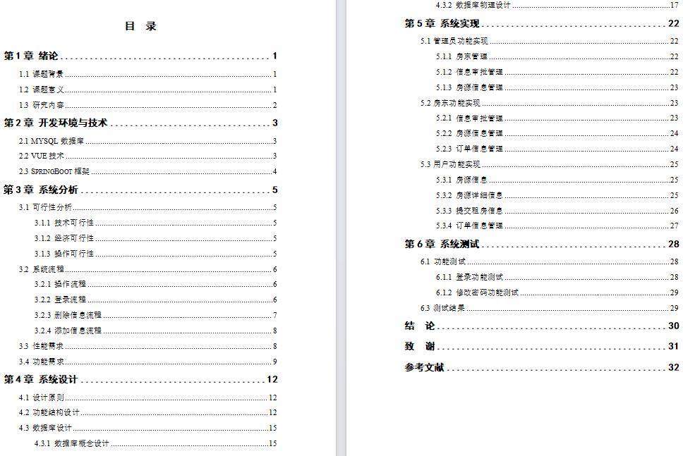
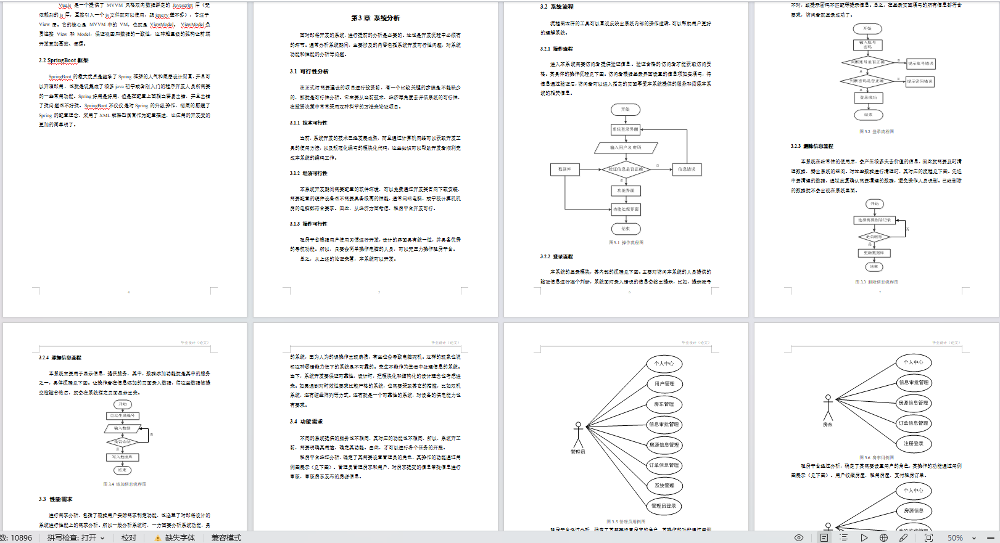
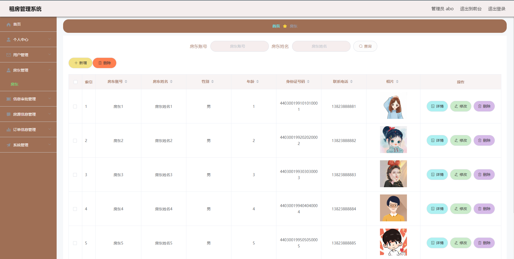
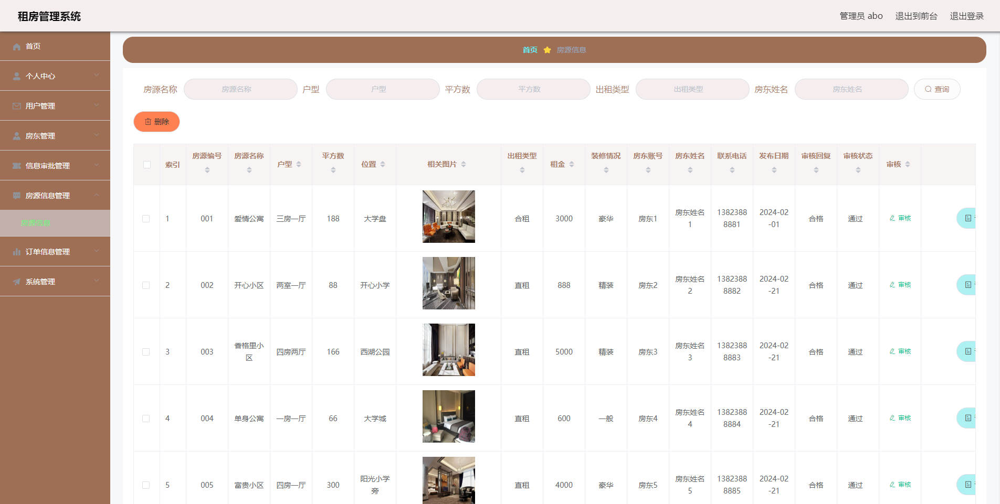

# 租房管理系统

### 9.9￥ 获取完整源码+sql，附赠10000字论文参考，需要加Q：3808981644  或者加微信 ：qszard26
### 有问题，或者需要协助调试运行项目的也可联系
### 获取更多项目，关注公众号：编程项目集

## 一、项目介绍

开发语言：java

运行环境:idea或eclipse 数据库:mysql

前端技术：Vue.js、ElementUI、HTML、CSS

后端技术：SpringBoot、Mybatis

角色:用户 房东 管理员

管理员：登录、个人中心、用户管理、房东管理、信息审批管理、房源信息管理、订单信息管理、轮播图管理

房东：注册、登录、个人中心、信息审批管理、房源信息管理（发布房源）、订单信息管理

用户：注册、登录、首页、房源信息查看、个人中心、房源收藏、租房、租房订单信息管理、支付房租

## 二、10000字论文参考

## 三、部分功能界面展示

### 9.9￥ 获取完整源码+sql，附赠10000字论文参考，需要加Q：3808981644  或者加微信 ：qszard26
### 有问题，或者需要协助调试运行项目的也可联系

